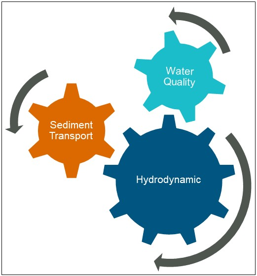

# Integrated Modelling Approach

The integrated approach to modelling the dynamic feedbacks between biotic and physical processes was used to simulate biogeochemical reponses to the future development and assess risk levels for environmental impact. The fully integrated model resolved the regional hydrodynamics, sediment transport and biogeochemistry of the Cockburn Sound existing pressures including wastewater and desalination discharges. 

## Key Model Components

There are three key components of the integrated model (Figure \@ref(fig:int-model)): 

1) Hydrodynamic 

The primary aim of the hydrodynamic model was to provide a precise representation of currents for determining the fate of the nutrient constituents and sediments. The hydrodynamic model is dynamically coupled to the sediment transport module and water quality module driving ecosystem processes such as the magnitude of nutrient and sediment fluxes through to the temperature dependence of primary productivity.

2) Sediment transport

This study has simulated the resuspension, dispersion and settling of sediment released into the water column under ambient conditions using a coupled hydrodynamic and sediment transport model.

3) Water quality 

The water quality model has ability to simulate interactions between biogeochemical variables including oxygen, carbon, nutrients (organic and inorganic), light, temperature, algal and zooplankton species.


```{r int-model, fig.cap='Components of the integrated biogeochemical model used in this study', out.width='80%',echo=FALSE,}
# include images created outside R

```

The following three chapters summarise the methods applied, and assumptions made that underpin the integrated biogeochemical model used in this study, including the model set-ups for each of the model components and the rationale supporting the model assumptions.


