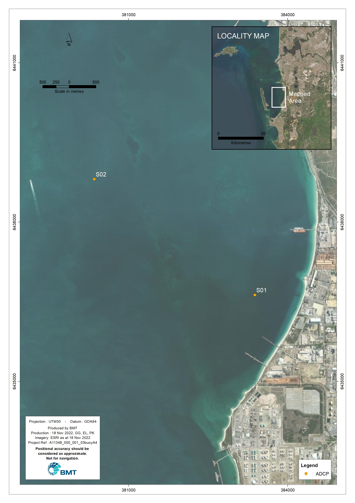

# Site Characterisation

## Study site description

Cockburn Sound is a semi-enclosed embayment bounded by the mainland to the east and south, and Garden Island to the west. The main opening to the Sound is to the north between Woodman Point (east) and the northeast tip of Garden Island. A causeway linking Rockingham to the southern end of Garden Island completes the western boundary of the Sound. This causeway was completed in 1974 and contains two openings 300 m and 600 m wide.

Cockburn Sound extends approximately 15 km from north to south and up to 9 km from east to west. The width reduces in the south, being approximately up to 5 km between the Causeway and East Rockingham. The Sound can be split into two main regions, a deep central basin with depths between 17 and 22 m and a marginal shore area with depths of up to 12.0 m particularly prominent on the eastern boundary (Figure \@ref(fig:CS-locality)). The deep basin occupies approximately 60% of the Cockburn Sound area (total of 110 km2).
Waters immediately north of the Sound (i.e. between Carnac Island and Owen Anchorage) sit on a sill that is relatively shallow with depths ranging between 2.0 and 5.0 m. Success and Parmelia Channel with depths of approximately 15.0 m deep are routinely dredged to allow shipping traffic in and out of Cockburn Sound. A range of shipping channels inside the Sound provides access to the local industry berths, including Woodman Channel, Jervoise Channel, Median Channel, Calista Channel and Stirling Channel. In particular, Calista and Stirling channels are relevant for the movement of the PDSP brine effluent in Cockburn Sound [@CWR2007].


```{r CS-locality, fig.cap='Key channels and outfalls in the Cockburn Sound', out.width='80%',echo=FALSE,}
# include images created outside R
knitr::include_graphics("images/CS_locality.png")
```

@Lourey2021 listed the following features of Cockburn Sound identified as driving the need for a coordinated response to environmental management.

* A semi-enclosed waterbody, relatively protected from wind and wave action leading to to poor flushing conditions.

*	One of the most intensely used marine areas in Western Australia.

*	Used by commercial and recreational fisheries, sensitive breeding ground for fish and other marine animals.

*	An established industrial hub with multiple discharges, ports and a desalination plant

*	Location of a number of proposed major developments (Perth Seawater Desalination Plant II and Westport)

*	Adjacent the rapidly developing urban centre of Rockingham 

*	Subject to a number of pressures and stressors and has a history of environmental degradation (particularly eutrophication)

*	An area of cultural significance to the Beeliar Nyungar known as Derbal Nara


## Data Avaialability

High quality data were collated from previously completed studies [@BMT2017; BMT2022; @Lourey2021]in the scope area sources to ensure maximum use of existing and historical data complemented by up-to-date project specific data
The following seven representative climatological simulation periods were simulated before calibration and validation of the hydrodynamic and dissolved oxygen model against historical observed data [@Lourey2021;@BMT2017]:

* Winter to Spring 2006

* Summer to Autumn 2007

* Sumer to Autumn 2008

*	Winter to Spring 2008

*	February to April 2011

*	February to April 2013

*	October to November 2015

These climatological simulation periods were selected to represent a range of typical seasons as well as hydrodynamic responses to extreme weather conditions.


Based on data availability, locality and relativeness, Year 2013 was selected for the first instance for the re-calibration.
Re-calibration was required due to the usage of different input data sources (i.e. ROMS and BARAA data) compared to to previous studies.See more details on section 4.3 under Boudary conditions. 

The locations of continuous, high frequency Metocean data (i.e. tides, currents, waves, salinity and temperature) used to support the calibration of the Cockburn Sound hydrodynamic model are listed in Table \@ref(tab:obs-table) and the sites are shown in Figure \@ref(fig:CS-met).


```{r obs-data,echo=FALSE,}
obs<-read.csv(file="table/obs_data.csv")
obs<- obs[,c(1,4:7)]
#head(obs)
```


```{r obs-table,echo=FALSE,}
library(kableExtra)
knitr::kable(obs, booktabs = TRUE, caption = 'Metocean data used for model re-calibration', 
              col.names = c("Site","Date Range","Type of Data","Variables","Custodian"))
```


```{r CS-met, fig.cap='Key locations of metocean data collection instruments used for calibration', out.width='80%',echo=FALSE,}
# include images created outside R

```

In combination with ocular inspection, model predictive skill was also tested statistically with calculations of the Index of Agreement (IOA), Mean Absolute Error (MAE), and Root Mean Square Error (RMSE).

