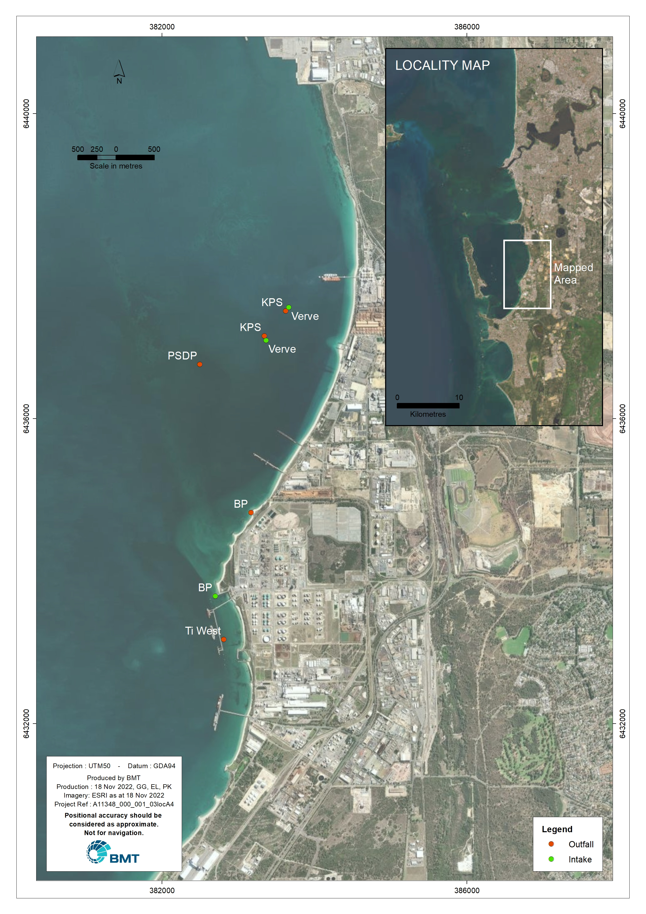
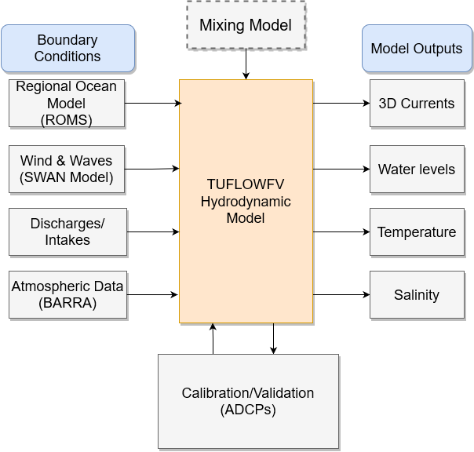

# Hydrodynamic Modelling 

## TUFLOWFV 3D Hydrodynamic Model

The hydrodynamic modelling was undertaken using the [TUFLOW FV](https://www.tuflow.com/products/tuflow-fv/) software, which is developed and distributed by [BMT](https://www.bmt.org/). TUFLOW FV is a numerical hydrodynamic model solving the two-dimensional (2D) and three-dimensional (3D) Non-Linear Shallow Water Equations (NLSWE). The model is suitable for simulating a wide range of hydrodynamic systems ranging in scale from open channels and floodplains, through estuaries to coasts and deep offshore. The three-dimensional model was deployed in this study.

The Finite-Volume (FV) numerical scheme employed by TUFLOW FV solves the NLSWE on unstructured meshes comprised of triangular and quadrilateral elements. The flexible mesh allows for seamless boundary fitting along complex coastlines or channels as well as accurately and efficiently representing complex bathymetries with a minimum number of computational elements. The flexible mesh capability is particularly efficient at resolving a range of scales in a single model without requiring multiple domain nesting. In the present study, a flexible mesh of triangular elements with varying spatial resolution has been employed. Furthermore, the models developed by BMT incorporate a hybrid (fixed z-sigma) coordinate scheme. 

TUFLOW FV provides various options to vertically average 3D output and thereby simplify post-processing tasks. Both
MATLAB and Python visualisation libraries are available for download on the TUFLOW website to assist with review and presentation of 3D results. Further details regarding the numerical scheme employed by TUFLOW FV are provided in the [TUFLOW FV Science Manual](https://downloads.tuflow.com/_archive/TUFLOW_FV/Manual/TUFLOW_FV_User_Manual_2020.pdf).


## Model domain, mesh and bathymetry 


The hydrodynamic model domain is shown in Figure \@ref(fig:model-mesh)(left) and extends from Mandurah in the south to Quinns Rock (10 km North of JoondaluP) in the north, covering approximately 125 km of coastline. Offshore the model extends approximately 42 km into the Indian Ocean to depths greater than 250 m.
The model consists of 29837 horizontal mesh cells with dimensions varying from approximately 2.0 km at the offshore boundary, and decreasing to 100 m in the vicinity of the Sound. Figure \@ref(fig:model-mesh)(right) shows a detail of the model mesh in the study area which includes the downstream waterways of the [Swan River](https://en.wikipedia.org/wiki/Swan_River_(Western_Australia)).
A 10 m digital elevation model (DEM) was adapted for the study area from a previously completed modelling project [@BMT2017]. A range of data sources were used for the bathymetry, including finer resolution multibeam data from the Australian Marine Complex (AMC) and Fremantle Ports Authority (FPA). Data from Geosciences Australia and General Bathymetric Chart of the Oceans (GEBCO) were used to complement the model domain bathymetry.


```{r model-mesh, fig.cap='Hydrodynamic model domain and bathymetry', out.width='80%',echo=FALSE,}
# include images created outside R
knitr::include_graphics("images/A11348_000_001_02meshA4_20221116.jpeg")
```


## Boundary conditions

The local hydrodynamics predicted by TUFLOW FV are influenced by boundary inputs. Information regarding appropriate boundary condition forcing for the study area was obtained from different sources. Details of the specific information sources used to the develop boundary conditions applied to the hydrodynamic model is proved below.


### ROMS - Tide, regional currents, salinity and temperature

The TUFLOWFV hydrodynamic model was provided with tides, regional current forcing (residual water level, current magnitude and direction), temperature and salinity profiles at the open boundary.

These data were provided by UWA as they sourced these from [ROMS](https://www.myroms.org/) (Regional Ocean Modelling System). It is a free-surface, primitive equations ocean model widely used by the scientific community for a diverse range of applications [@Haidvogel2000]. ROMS is used by UWA researchers through the whole state: from the Kimberley region to the north extending into South Australia. Within this domain there are a number of applications focusing on specific regions and processes [@Middleton2012].

The ROMS regional model extends from the Kimberley to Bass Strait, and has a few sub domains (ex;north-west, central-west and south-west) with 1-2 km horizontal resolution and 30 sigma layers in the vertical water column [@Middleton2012]. As described in Middleton et al (2012), the model was forced with daily atmospheric (wind and air pressure) and air sea fluxes (heat and freshwater). The model open boundaries were specified with monthly salinity and temperature climatology. The model forcing included tides and monthly mean sea levels. The model initial and forcing data were extracted from various global and Australian oceanographic/meteorological data sources and interpolated in to surface horizontal mesh and open boundary vertical sections. Details of the numerical algorithm of ROMS have been described in [@Shchepetkin2005].

It has a generalized vertical, terrain-following, coordinate system. In addition to that, horizontal velocity components, salinity and temperatures are computed on separate grids (Figure \@ref(fig:stv-grid)). Spatial resolution of ROMS data were post processed to linearly interpolate onto the TUFLOWFV model mesh. The locations at which ROMS data were sourced are shown in Figure \@ref(fig:roms-locations).


```{r stv-grid, fig.cap='A snapshot of ROMS seprate grids for salinity, temeperatire and velocty components', out.width='80%',echo=FALSE,}
# include images created outside R
knitr::include_graphics("images/stv_roms_grid_conversion.png")
```


```{r roms-locations, fig.cap='ROMS data sourcing locations', out.width='80%',echo=FALSE,}
# include images created outside R
knitr::include_graphics("images/A11348_000_001_03ROMSA4_20221207.jpg")
```


### BARRA - Atmospheric data

Atmospheric boundary condition data including

* air temperature

* downward long-wave radiation

* downward short-wave radiation

* mean sea level pressure

* precipitation rate

* relative humidity

* wind magnitude and direction at 10m

were sourced from [BARRA](http://www.bom.gov.au/research/projects/reanalysis/). BARRA is designed for providing multi-decadal (1990-2019) high spatial and temporal resolution, meteorological data from surface to lower stratosphere.  BARRA-R Regional 12 km domain within the light blue dotted box, covers all of Australia, New Zealand and the maritime continent. Smaller black boxes are the 1.5km subdomains centred over some major Australian cities, Sydney, Hobart, Adelaide and Perth (Figure \@ref(fig:barra-domain)).


Sourced reanalyses data and then applied to TUFLOW FV to support its simulation of water column heat dynamics. These model input fields were spatially uniform (i.e. gridded) but varied in time in order to represent both seasonal and higher-frequency variations (e.g. diurnal, weekly, etc..). The locations at which these data were sourced are shown in Figure \@ref(fig:barra-locations).


```{r barra-domain, fig.cap='BARRA domains and sub-domains (Sourced from BOM http://www.bom.gov.au/research/projects/reanalysis/)', out.width='80%',echo=FALSE,}
# include images created outside R
knitr::include_graphics("images/barra_domain.png")
```


```{r barra-locations, fig.cap='BARRA data sourcing locations', out.width='80%',echo=FALSE,}
# include images created outside R
knitr::include_graphics("images/A11348_000_001_03BARRAA4_20221207.jpg")
```


### SWAN - Wave Model

Wave modelling was included in the assessment to capture sediment resuspension and dispersion from wave action in shallow areas, likely to be significant in determining sediment plume behaviour. The wave modelling component of these assessments has been undertaken using the third generation wave model Simulating WAves Nearshore (SWAN). It is an Eulerian formulation of the discrete action balance equation [@Booji1996]. Since it preserves the action density in ambient currents, it was selected as a tool to perform the required simulations of wave-current interaction. SWAN simulates wave/swell propagation in two-dimensions, including shoaling and refraction due to spatial variations in bathymetry and currents. This is a global industry standard modelling package that has been applied with reliable results to many investigations worldwide.

For sediment re-suspension and dispersion modelling the SWAN wave model was coupled with the 3D TUFLOW FV hydrodynamic and advection-dispersion models. This required the wave simulations to be completed separately, with the model output stored at hourly intervals on regular grids. During the subsequent sediment re-suspension and dispersion simulations, the wave conditions were linearly interpolated spatially from the grids to the TUFLOW FV mesh.

Previously used calibrated SWAN model [@BMT2022] was recommissioned for this work. 


A two-grid nesting approach was adopted for the study. The grid set-up was as follows:

* A regional-scale model, A-grid, (Figure \@ref(fig:wave-domian)) was set up in order to introduce the offshore wave forcing conditions to the study area. A-grid covers an area of approximately 76.5 km (east-west) by 112.6 km (north-south). To ensure that the wave transformation over the nearshore shelf is properly replicated by the wave model the domain extended offshore to 500 m water depth. The size of the regional scale domain enabled the input of spatially and temporally variable offshore wave conditions across the boundaries. The regional scale model was forced by several offshore wave data points obtained from global wave models. This approach is considered significantly more robust than the conventional method using one point of measured (or modelled) data as the offshore boundary. Adopting this approach, the modelling framework captured the offshore wave variability across the boundaries resulting in more accurate and reliable nearshore wave predictions.

* An intermediate scale model, B-grid, (Figure \@ref(fig:wave-domian)) was set up to refine the resolution of the solutions from A-grid; B-grid extends approximately 43 km offshore and 75 km alongshore. 

The domain size and model resolutions are outlined in Table \@ref(tab:wave-table).


```{r wave-domian, fig.cap='Key discharge and intake locations in the Cockburn Sound', out.width='80%',echo=FALSE,}
# include images created outside R
knitr::include_graphics("images/swan_wave_model_domain.png")
```


```{r wave-table,echo=FALSE,}
wave<-read.csv(file="table/wave_model _domain.csv")

knitr::kable(wave, booktabs = TRUE, caption = 'SWAN wave model domain characteristics',
             col.names = c("Model description","Grid name","Model X length","Model Y length","Model resolution"))
```


### Inflow - Swan River 

Freshwater flows draining to the Swan-Canning River estuary were also accounted for in the model. Canning river site and Narrows Bridge site were selected as tidal boundaries of the Swan River, based on data availability and the locality (Figure \@ref(fig:swanriver-bc)). Swan River boundary condition data including water level, salinity, temperature and nutrients were provided by UWA. Water level data at two tidal boundaries of the Swan river is shown in Figure \@ref(fig:swanriver-wl)


```{r swanriver-bc, fig.cap='Tidal boundary locations (Canning River site Narrows Bridge site) in the downstream area of the Swan River', out.width='80%',echo=FALSE,}
# include images created outside R
knitr::include_graphics("images/SwanRiver_BC.png")
```

```{r swanriver-wl, fig.cap='Daily water level changes at Canning River site Narrows Bridge site from 2010-2021', out.width='80%',echo=FALSE,}
# include images created outside R
knitr::include_graphics("images/swan_river_WL.png")
```


### Discharges and Intakes

Intakes and outfalls for other industries operating in Cockburn Sound were adopted in the model. These data were sourced from previous BMT projects [@BMT2014;@BMT2017] are summarised in Table \@ref(tab:dis-table). The relevant intake and discharge locations are shown in Figure \@ref(fig:dis-locations). A 100% DO saturation (based on temperature and salinity and @BMT2017) was assumed for the boundary conditions.

```{r dis-data,echo=FALSE,}
dis<-read.csv(file="table/cs_discharges.csv")
#head(dis)
```


```{r dis-table,echo=FALSE,}
library(kableExtra)

# dis %>%
#   kbl(col.names = c("Boundary condition","Flow rate\n($m^{3}$/s","Temperature\n($^0$C)","Salinity","DO"),
#       booktabs = TRUE, escape = FALSE) %>%
#   #kable_styling() %>%
#   kable_paper("hover", full_width = F)%>%
#   add_footnote("Note:Discharge flow rates the same intake flow rates unless noted. Temperature, salinity and DO not applicable to intakes.", notation="none")
knitr::kable(dis, booktabs = TRUE, caption = 'Industrial discharges and intakes boundary conditions', 
              col.names = c("Boundary condition","Flow rate\n($m^{3}$/s)","Temperature\n($^0$C)","Salinity","DO"))
```


```{r dis-locations, fig.cap='Key discharge and intake locations in the Cockburn Sound', out.width='80%',echo=FALSE,}
# include images created outside R



```

## Model Parameterisation

### Vertical discretisation

The hydrodynamic model was undertaken in 3D baroclinic mode adopting a hybrid sigma/z-coordinate layer scheme. Between the model surface and -3.0 mMSL four flexible sigma layers were applied and were able to vary in vertical thickness depending on the tidally dominated changes in water surface elevation. Below -3.0 mMSL a z-coordinate scheme was applied with vertical layer thicknesses of 0.5 m in shallow water (between depths of -3.0 mMSL and -22.0 mMSL) increasing in deeper offshore areas beyond the edge of the continental shelf. A maximum of 30 z-layers were resolved in the deeper sections of the model domain. This high degree of vertical resolution in the top 22.0 m of the water column was necessary in order to simulate vertical stratification within the water column. 


### Active scalars 

Salinity and temperature were simulated within the model as density-coupled scalar constituents in order to incorporate baroclinic density gradient forcing and more importantly the effect of vertical density stratification on turbulent mixing in the water column. 


### Bottom roughness
A default global default bottom roughness length scale (ks) of 0.002 m was used except in at the edge of the shelf, where ks was set to 0.2 m with spatial reconstruction used within Cockburn Sound to capture the domain transitioning from the shallow eastern shelf to the waters in the deep central basin. The adjustment of the local values for ks was undertaken as part of the hydrodynamic model calibration process conducted at Cockburn Sound scale [@BMT 2022]. 

### Turbulence closure scheme
The General Ocean Turbulence Model (GOTM) was coupled with the 3D TUFLOW FV hydrodynamic model in order to simulate the vertical mixing processes in the presence of density stratification (http://www.gotm.net/).


Further details of the TUFLOW FV model configuration and parameterisation are summarised in Table \@ref(tab:param-table). 


```{r param-table,echo=FALSE,}
param<-read.csv(file="table/model_param.csv")

knitr::kable(param, booktabs = TRUE, caption = 'Summary of TUFLOW FV model configuration and parameterisation',
             col.names = c("Model Configuration Description","Model/Value"))
```


## Summary of model design

Figure \@ref(fig:model-schem) shows the numerical model configuration with key components including boundary conditions, mixing model, model outputs and calibration/validation feedback. 


```{r model-schem, fig.cap='Schematic of Numerical Model Configuration', out.width='80%',echo=FALSE,}
# include images created outside R



```