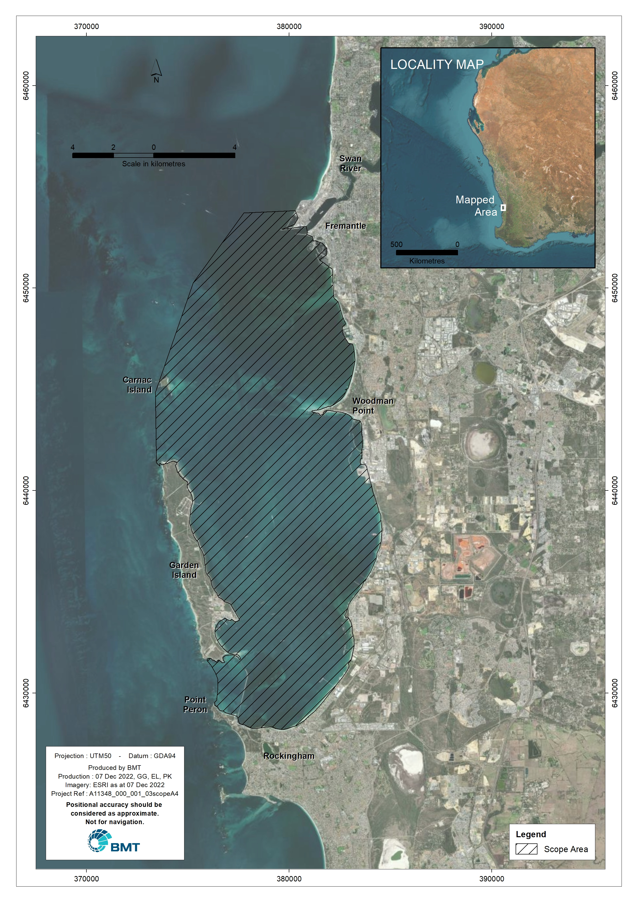

--- 
title: "Development of a water quality response model for Cockburn Sound"
author: 
      - Gayan Gunaratne^[BMT Australia, gayan.gunaratne@bmtglobal.com] Kabir Suara^[BMT Australia, kabir.suara@bmtglobal.com] and Louise Bruce^[BMT Australia, louise.bruce@bmtglobal.com]
date: "`r format(Sys.Date(),'%d %B, %Y')`"
site: bookdown::bookdown_site
documentclass: book
bibliography: [book.bib, packages.bib]
#biblio-style: authoryear
csl: apa.csl
url: https://glgunaratne.github.io/bookdown_CS001/
# cover-image: path to the social sharing image like images/cover.jpg
description: |
  A technical Report
link-citations: yes
github-repo:  glgunaratne/bookdown_CS001 
---

# About


## Project description

The project is part of the Integrated Modelling research theme in the [WAMSI-Westport Marine Science Program](https://wamsi.org.au/research/programs/wamsi-westport-marine-science-program/).
Fundamental to assessing the impacts of future changes within Cockburn Sound and associated waters (Figure \@ref(fig:CS-studysite)), and identifying useful mitigation options is the development of a water quality model able to link hydrodynamics, biogeochemistry and the essential ecosystem processes. Coupled hydrodynamic-biogeochemical models can help focus management effort and provide a vehicle to bring together to the diversity of data that has been collected over many years and is being collected within this science program.
Key attributes of the system that need to be clearly understood and quantified include oxygen, nutrients, sediment, algae and water clarity. The link between water quality and benthic communities such as seagrass in Cockburn Sound is also well established, and an integrated modelling tool is needed to quantify the links between them for the purposes of impact assessment and designing mitigation portfolios. 


```{r CS-studysite, fig.cap='Scope area - Cockburn Sound and associated waters', out.width='80%',echo=FALSE,}
# include images created outside R

```

BMT was commissioned by the [Aquatic Ecodynamic](https://aed.see.uwa.edu.au/research/models/aed/) Research Group of the [University Of western Australia](https://www.uwa.edu.au/) to deliver the first base platform of a coupled hydrodynamic - water quality model for Cockburn Sound and surrounding waters – termed the Cycle I model in the head agreement [@UWA2022]. The model developed under this agreement will be available for use by researchers and industry for scenario assessment, and further research and development.**


## Services Description  

Setup of Hydrodynamic-Biogeochemical Model for Cockburn Sound and surrounding waters

* Data inventory and gap analysis.

* Updated mesh, refined around Cockburn Sound and designed to nest within the regional ROMS model being used to supply oceanic boundary conditions.

* Creation of processing scripts for creating ocean boundary condition files from ROMS, SCERM, and WRF model outputs using python, or as agreed with the project steering group

* Configuration of material zones in the simulation based on bathymetry and benthic substrate.

* Operation of the TUFLOW-FV hydrodynamic model for representative climatological simulation periods and model assessment and benchmarking against the model performance metrics achieved in the Water Corporation simulations. 

* Data collation and processing to create nutrient loading boundary condition files, considering a groundwater and local stormwater inputs

* Development of a base AED simulation for the agreed simulation period with a configuration developed in collaboration with the project steering group

* Creation of a benthic input csv file for seagrass biomass

* Model assessment of water quality (oxygen, nutrients, turbidity and chl-a) from routine monitoring sites and the DWER monitoring buoys, able to compare:
  + Time series comparison
  + Statistical measures of model performance and error metrics  
  + Vertical profile time-series comparisons


## Deliverables

* Participation in Project 1.2 meetings and model co-design

* Model input files for TUFLOW-FV simulation, including relevant 2dm, fvc, csv and netcdf files.

* Model input files for the AED coupled simulation, including relevant nml and csv files with model configuration and parameters.

*	Model processing scripts for creating inputs, and reporting model outputs.
*	Calibration report describing model setup, assumptions and performance


The report presents a data sourcing and numerical modelling work of BMT conducted in partnership with the UWA providing guidance in data sourcing, model selection and model parameterisation.


```{r include=FALSE}
# automatically create a bib database for R packages
knitr::write_bib(c(
  .packages(), 'bookdown', 'knitr', 'rmarkdown'
), 'packages.bib')
```
